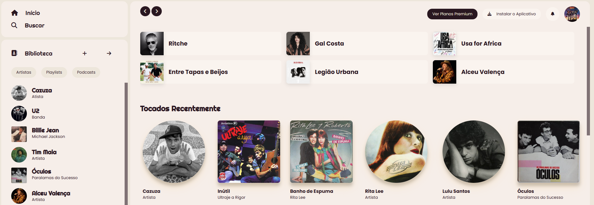

# <h1 align="center">Spotify anos 80</h1>

Se trata de um projeto no qual a interface e as opções de música do Spotify receberam uma viagem para os anos 80

  

  ## :rocket: Tecnologias Usadas
  
  -  CSS
  -  HTML
